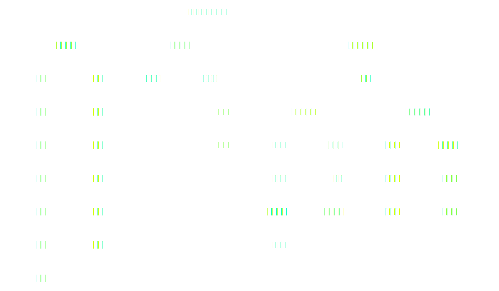
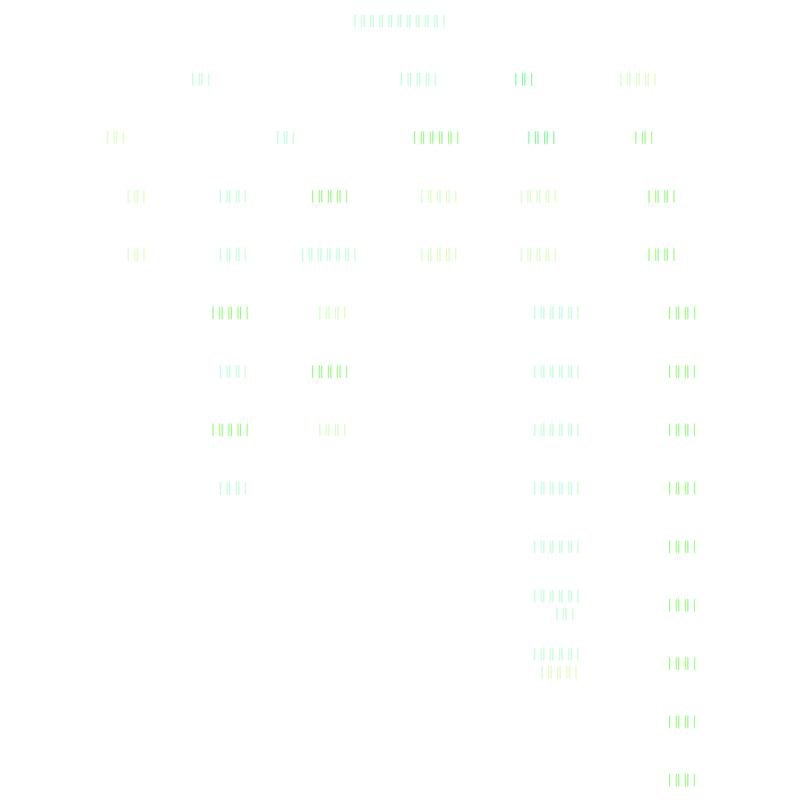

1. 1908年7月4日：女子师范学堂（北京女子师范大学前身）成立

2. 1912年：京师女子师范学堂改为北京女子师范学校

    > 人物：吴鼎昌

3. 1912年至1913年：教育部公布师范教育的新制度，北京女子师范学校分别调整学校规程

    > 1912年9月3日教育部颁布《学校系统令》即《壬子学制》，规定:中学4年毕业，毕业后得入大学或专门学校或高等师范学校。高等师范学校本科3年毕业，预科1年毕业。
    >
    > 1912年9月29日教育部颁布《师范教育令》，共13条。规定:高等师范学校以造就中学及师范学校教员为目的。女子高等师范学校以造就女子中学及女子师范学校教员为目的。高等师范学校定为国立。由教育总长通计全国规定地点及校数分别设立。学校经费由国库支给。高等师范学校学生免纳学费，并由学校酌给校内必费用，此外，也收自费学生。高等师范学校应设附属小学、中学，女子高等师范学校于附属小学外，应设附属女子中学，并设蒙养园。高等师范学校及女子高等师范学校得设选科、专修、研究科。高等师范学校之修业年限、学科目及程度，编制及设备，学生入学资格及毕业后服务等，别以规程定之。
    >
    > 同日教育部公布《征收学费规程》，共16条，规定高等师范学校免征收学费。
    >
    > 1912年12月女子师范学校颁布《师范学校规程》，规定:“预科之学科科目为修身、读经、国文、习字、外国语、数学、图画、乐歌、体操。女子师范学校，加课缝纫。”北京女子师范学校分为预科、本科和讲习科。按照《师范教育令》女子高等师范学校才可设置专修科。

4. 五四运动期间的北京女子师范学校

    > 5月4日当天，北京女子师范学校的学生由于学校和家长的阻挠，没有参加示威游行。5日，女子师范学校国文系教师陈中凡走近教室，将4日13所学校学生上街游行、火烧赵家楼、痛打章宗祥等情形告诉大家，课堂里呈现出从未有过的骚动。经集会后，女子师范学校派出代表到全市各女校进行宣传动员，于5月7日发起成立了“北京女学界联合会”。从此，一个以女高师为核心的女性力量投入了五四运动的洪流之中。

5. 1919年6月4日：北京女子师范学校学生冲出校门，结队游行并到总统府请愿

    > 五四运动以来学潮汹涌澎湃，北京学生四处讲演反对外国人干涉中国主权，反对官僚卖国。6月1日，北洋政府为曹汝霖、陆宗舆和章宗祥三人辩护，诬蔑学生为不逞之徒。6月2日晚上，学界联合会议决定3日再去大街上讲演的消息被北洋政府知晓，北洋政府在6月3日再次逮捕了上街演讲游行的学生千余人，将他们幽禁在北京大学。6月4日清晨，女子师范学校学生知晓这一信息后愤慨异常，立即和各校代表开会决定下午13点，十五校女生各穿学校制服游行、到天安门内会齐和上总统书。女子师范学校校长方还因为前几天从北洋政府处得到一个五等嘉禾章，所以把校门封锁起来禁止学生外出游行。以钱丞为代表的女子师范学校学生奋力开门、抛砖投石，成功打开了校门。女子师范学校学生举着写有“打倒日本”、“打倒卖国贼”等标语的旗子，和其他女校近千名学生一道，排成整齐的队伍来到总统府前，要求政府派人接见。总统府要员拒不出场，最终学生代表向总统秘书递交了请愿书。女学生说明要求四件事:（一）大学不能作为监狱；（二）不可拿待土匪的法子来待高尚的学生；（三）以后不得再叫军警干涉爱国学生的演说；（四）对于学生只能告诫，不能虐待。秘书答应学生三日之内回话。一位学生归来时兴奋地说道：“这是女子第一次的干政游行！”，另外事后一位学生回忆说：“那天狂风猛沙，飞沙走石，每个人的脸上都加上了一层黑灰，好像煤球一样，而且回校时已经黄昏了，但各校的队伍依然井然有序，没有人随便谈话，也没有人脱离队伍。”
    >
    > 游行结束后，女子师范学校及其他女校的代表随即前往北大，慰问被关押在那里的被捕学生。她们还送去了募集的几千枚铜元，以接济被捕学生的生活。
    >
    > 影响：女子师范学校是当时的北京女校之首，她们的斗争起到了良好的示范带头作用。五四运动中，女子师范学校学生冲出校门结队游行，参加政治斗争，吹响了中国女性寻求自我解放，争取平等权利的第一号角，是历史上的伟大创举。

6. 1919年9月：北京女子师范学校正式改名为北京女子高等师范学校

    > 北京女子师范学校正式改名为北京女子高等师范学校，成为我国历史上第一所由国家正式设立的女子高等教育机构。自此，女高师开始了由中等层次的师范教育机构向高等层次的师范教育机构迈进的改造。该校将原有的国文专修科二年级改为文科国文部一年级，除去原来的24名学生外，加上13名选科生，共计37人；博物专修科学生改入理化博物部预科又招了家事预科、保姆讲习科。原有女子师学校本科依照原来办法办理，至毕业为止，不续招生。此时，全校共有学生260人，职员26人，教员45人，其中兼职教员3人。

7. 1924年5月1日：北京女高师改为国立北京女子师范大学

    > 5月1日，教育部令准北京女高师改为国立北京女子师范大学，任命杨荫榆为校长，原女高师校长许寿裳的辞职获准。

8. 1924年7月-8月：国立北京女子师范大学修订组织大纲

    > 教育部令准北京女师大所拟《女子师范大学组织大纲》试行。大纲规定:本校定名为国立北京女子师范大学。设数学、物理学、化学、生物、地质学、教育学、哲学、史学、国文学、英文学、音乐、体育等12系，修业年限4年。大学预科设甲乙二部，修业年限2年。本校本科毕业学生得称学士。
    >
    > 办学宗旨：
    >
    > 1. 养成中等学校师资
    > 2. 养成教育行政人员
    > 3. 研究高深学术
    > 4. 发展女性特长

9. 1925年至1926年：女师大风潮

    > 1925年1月23日，女师大部分学生代表赴教育部请校长杨荫榆离校，并发表学生宣言。
    >
    > 5月7日女师大召开“五七”国耻纪念会，学生自治会因为不承认杨荫榆为校长，事先请总务长吴戒逸担任大会主席。大会开始，杨荫榆仍旧以校长身份登上主席台，最后在自治会代表的坚持反对下离去。当日下午，杨荫榆召集女师大评议会成员开会，议决开除张平江、郑德音、许广平、蒲振声、刘和珍、姜伯谛等6名自治会代表。
    >
    > 5月12日鲁迅到女师大参加会议，并作《为北京女师大生拟呈教育部文》，列述杨荫榆之罪状，要求“迅予撤换，拯本校于阽危，出学生于水火”。
    >
    > 5月27日《关于北京女子师范大学宣言》在《京报》发表，该《宣言》由鲁迅拟稿并邀请马裕藻等六名教师签名。
    >
    > 8月1日女师大校长杨荫榆武装到校，宣布解散大学预科甲、乙两班，高师国文科三年级及大学教育预科一年级各1班。
    >
    > 8月2日北京各大学代表在中央公园开会，推举李泰棻、王世杰、李煜瀛、易培基、熊希龄等为代表向政府交涉，援助女师大。
    >
    > 8月6日政府内阁决议，决定停办国立北京女子师范大学，由教育部派员接收。
    >
    > 8月13日教育总长章士钊约学生家长、保证人开茶话会，请家长劝学生迁出，未果。
    >
    > 8月17日教育部部务会议决定将北京女子师范大学改组女子大学，并设立筹备处，由章士钊亲自兼任处长。
    >
    > 8月18日北京大学评议会召集会议，以章士钊解散女大，实为教育界罪人，议决脱离教育部，宣布独立。
    >
    > 8月19日教育总长章士钊到女子师大接收校舍，发生武力拒绝，15人被巡警拘捕。
    >
    > 8月21日鲁迅、钱玄同、马衡、沈尹默、顾孟余等41人发表宣言，不承认章士钊为教育总长。本月鲁迅等人组织成立“女师大校务维持会”，起草《对于北京女子师范大学风潮宣言》，邀请其他教授共同签名发表，表示严正态度。女师大被宣布解散后，鲁迅、许寿裳、马裕藻等教师在报子街的女师大补习学校设临时办事处，筹备招生和开学。
    >
    > 9月21日女师大租定阜成门内南小街宗帽胡同14号为校址，在校务维持会的主持下，举行开学典礼，鲁迅在会上讲话。当天到会师生、家长和各校代表达200多人。
    >
    > 12月24日临时执政府令，“国立北京女子大学及国立北京女子师范大学均着继续兴办，着财教两部迅筹办法呈报”，并撤销杨荫榆校长职务。
    >
    > 12月31日临时执政府任命易培基为教育总长。易培基就任后，自兼女师大校长，欢迎宗帽胡同的护校女生复校。石驸马大街的原女师大校址虽然为女子大学学生所占驻，但大多数学生同情女师大学生复校。两校学生同赴教育部请求拨给校舍。
    >
    > 1926年1月13日女师大开会欢迎易培基出任校长，教务长许寿裳主持大会，鲁迅代表校务维持会致欢迎词，许广平代表学生自治会致词。持续一年的女师大风潮宣告结束。

10. 1926年3月18日北师大、女师大在“三·一八”惨案中

    > 前奏：3月17日共产党和国民党左派领导的国民党北京市党部、广州外交代表团、北京大学、北京师范大学、中法大学、女子师范大学、中国大学等团体和学校的代表，在北大三院礼堂开会，议决:驳复公使团对中国政府的通牒，不许日舰带奉系军舰进入大沽口，驱逐八国公使出京等。决定于次日在天安门前开国民大会。
    >
    > 兴起：3月18日师大、北大、女师大等校学生和各界群众5000余人在李大钊等人的领导下，在天安门前召开国民大会，要求段祺瑞政府拒绝日、英、美、法、意、荷、比、西八国提出的撤除大沽口国防设备的最后通牒，抗议日舰12日对大沽口的炮击。会后举行游行示威，师大学生队伍由黄道（共产党师大支部书记）、邵式（师大学生会主席）带领。2000多人往铁狮子胡同向段祺瑞执政府请愿，段命令卫队开枪射杀请愿群众，死者达数十人，伤者200余人，制造了“三一八”惨案。师大在这次革命斗争中牺牲的烈士有范士荣，女师大的有刘和珍、杨德群。
    >
    > 后续：1926年3月24日学校召开范士荣追悼大会，全校师生以及各界人士共万人参加。会议由校长张贻惠主持。3月25日女师大举行刘和珍、杨德群两烈士追悼大会，由许寿裳主祭。鲁迅出席了追悼会，会后作《记念刘和珍君》一文。3月26日女师大刘和珍、杨德群两烈士出殡。北京师大举行范士荣纪念碑奠基礼，后出殡。3月29日北师大、女师大、北大等校学生以及北京各界昭雪会等200余团体，在北大一院举行“三月十八殉难烈士国民追悼大会”。

11. 1926年8月28日：经国务会议议决，教育部发表部令，令国立北京女子师范大学与女子大学合并为国立北京女子学院，分设师范与大学两部

12. 1927年7月至8月：国立九校合并为国立京师大学校，国立北京师范大学改称京师大学校师范部，女师大改称京师大学校女子第一部

    > 教育总长刘哲呈请大元帅拟将京师原有国立9所大学即北京大学、北京师范大学、北京女子师范大学、北京女子大学、北京法政大学、北京医科大学、北京农业大学、北京工业大学、北京艺术专门学校等合并为一所大学，总称为国立京师大学校。大学校之下分设文、理、法、医、农、工等六科，师范一部，商业、美术两专门部，女子师范分设第一、第二两部。设置校长1人，总辖全校事务，各科部分别设立学长1人，分掌主管校务，校长、学长均由教育总长聘任。随后，教育部成立国立京师大学校筹备委员会，负责改组筹备中的一切事宜，原北京高等师范学校校长、现任教育部普通教育司司长陈宝泉被任命为京师大学校师范部筹备员。
    >
    > 北京国立九校合并为京师大学校，教育部长刘哲兼任校长。国立北京师范大学改称京师大学校师范部，仍聘张贻惠为师范部学长；附属中小学也隶于京师大学校，附属中学改为国立京师大学校附属中学校，聘张鸿来为主任；女师大改称京师大学校女子第一部，毛邦伟任学长。

13. 1928年6月至11月，京师大学校师范部改为国立北平大学第一师范学院，京师大学校女子第一部改为国立北平大学第二师范学院

    > 6月京师大学校师范部恢复原国立北平师范大学校名，附属中小学亦改隶国立北平师范大学，附属中学改称为国立北平师范大学附属中学校，聘林砺儒担任主任。
    >
    > 7月19日南京国民政府会议议决，北平国立各校合组为“国立中华大学”，以李煜瀛为校长，李书华为副校长。
    >
    > 7月23日师大学生为谋求本校复大独立，联合学生会、自治会组织独立运动委员会，发动护校运动，反对并入北平大学改称师范学院，并推代表向五次全会请愿。请愿书上提出师范大学应单独设立的8点理由。
    >
    > 7月师大毕业生致电南京大学院，主张师大独立。师大独立运动委员会向教育界人士发出公函，请求援助，并派黄国梁、戚维翰两代表赴南京请愿。
    >
    > 9月11日北平国立中华大学迄未组织，国立九校开学无期，学生为读书运动，特发沉重宣言。
    >
    > 9月21日国民政府议决国立中华大学改称为国立北平大学（包括北京大学等各校），并通过《北平大学区组织大纲》（大学区管辖河北、热河两省及天津、北平两特别市），李煜瀛仍为北平大学校长。
    >
    > 9月女师大改为国立北平师范大学第二部。
    >
    > 11月北平国立九校与俄文法政专校、天津北洋大学、保定河北大学合并为国立北平大学，改组为11个学院和5个附小。李煜瀛为校长，李书华为副校长。师大改称国立北平大学第一师范学院，聘黎锦熙为院长，旋辞职，并请林砺儒、李顺卿、曾绍舆为临时院务委员会委员，林砺儒为主席。后改聘张贻惠为院长。女师大改称国立北平大学第二师范学院，李书华代理院长。附属中学、小学、蒙养园又改隶北平大学，继续聘任林砺儒为附属中学主任，韩定生为附属小学主任，欧阳晓澜为附属女子中学主任，孙世庆为附属女子小学主任，另聘李光华为附属蒙养园主任。

14. 1929年12月：国立北平大学第二师范学院改称国立北平大学女子师范学院

    > 1929年12月14日教育部批准北平大学第二师范学院改称国立北平大学女子师范学院，徐炳昶为院长。
    >
    > 后续：1930年1月26日教育部指令北平大学，女附中应改隶女子师范学院，北平大学21次校务会议决议遵令执行。
    >
    > 本月因女附中附属问题发生风潮，师生分别致电教部，反对改隶；学生家长致电教育部，认为没有改隶的必要。徐炳昶致函师生及学生家长，说明女附中隶属女师院理由。女附中学生以护校会名义拒绝执行教育部改隶命令。

15. 1931年7月1日：国立北平师范大学与国立北平大学女子师范学院正式合组为国立北平师范大学

    > 1931年2月9日教育部订定整理北平大学各学院7项办法，训令遵照执行，其中第一项为女子师范学院及附属学校与北平师范大学合为国立北平师范大学。
    >
    > 1931年2月10日教育部训令国立北平师范大学，内容为:暂分一、二部，原有国立北平师范大学为第一部，原有女子师范学院为第二部，两部学系避免重复建设，设立学院，并于暑假前拟具详细办法；女师院经费照领；课程设置设备训练等以培养中等学校师资及教育行政人员与研究教育学术为宗旨；原有两校附属学校应渐规划，成为学校整体，并与大学有密切联系。
    >
    > 1931年2月11日教育部训令学校改进校务:增加设备经费；限制教员兼课；厉行考查制度；严格考试；整顿斋务。同日教育部令北平大学，两师大不再隶属该校。
    >
    > 1931年2月16日教育部令筹备改组，以原有国立北平师范大学与国立北平大学女子师范学院合组为国立北平师范大学。
    >
    > 1931年2月21日教育部任命原北平大学女子师范学院院长徐昶为国立北平师范大学校长。
    >
    > 1931年6月29日两部部务联席会议决议:7月1日起两部合组国立北平师范大学，两部名义同时取消；原有11系分为教育学院、文学院、理学院，文学院设原二部原址，教育学院、理学院及办公处设一部原址；学校改组后，即期成立校务会议，遵照部章组成。
    >
    > 1931年7月1日国立北平师范大学正式合组，分设教育学院、文学院和理学院。教育学院开设教育系、体育系，文学院开设国文系、外国文学系、历史系、社会科学系，理学院开设数学系、物理系、化学系、生物系、地理系。教育院、理学院及办公处设在和平门外的南新华街，即原第一部旧址，文学院设在宣武门内的石驸马大街，即原第二部及研究所旧址。李建勋、黎锦熙、刘拓分别担任三个学院的院长，聘请李建勋、袁敦礼、钱玄同、罗昌、黄文山、赵进义、文元模、刘拓、李顺卿、王谟等教授分别担任教育、体育、国文、英文（外文）、社会学科（社会学）数学、物理、化学、生物、地理等各系的系主任（历史系主任暂时空缺）。将原北平女子师范学院研究所改为研究院，先设置历史科学门和教育科学门，地址设在师大原址，聘请黎锦熙、钱玄同、李建勋、刘拓、李顺卿、程廼颐、傅铜、朱希祖等教授为研究委员会委员，研究院院长由校长兼任。原有两校的图书馆同时合并组建为一个馆，聘请陆华深为馆长，在教育学院和理学院校区内设总馆，文学院校区内设分馆。原第一院附属中学，改称北平师范大学附属中学南校，男女生兼招，男女生同校不同班；原第二院附属中学，改称附属中学北校，基于历史传统，仍专招收女生。原第一院附属小学改称第一附属小学；原第二院附属小学，改称第二附属小学。原第二院附属蒙养园改称幼稚园。
    >
    > 1931年7月3日学校布告:奉教育部249号训令，两师大合组国立北平师范大学，过渡时期名义取消。

### 组织结构

1. 《京师女子师范学堂暂行章程》（清）学部订1908年

  

  注：简易科官费生完成学业后须前往中小学堂进行教学

2. 《国立北京女子师范大学概略》1926年

  